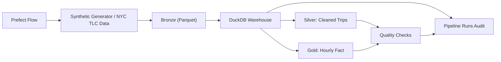
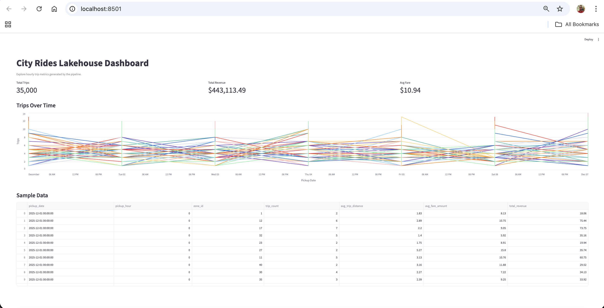

# City Rides Lakehouse

[](https://github.com/Vishnu567456/city-rides-lakehouse/actions/workflows/ci.yml)

A portfolio-grade, end-to-end data engineering project that simulates a ride-hailing platform and builds a lakehouse-style pipeline from raw events to analytics-ready marts. It showcases ingestion, data modeling, quality checks, and orchestration with clear documentation and reproducible runs.

**Why it stands out**
- Supports both synthetic demo data and real NYC TLC trip data
- Realistic schema and business metrics
- Append-only partitioned raw data with batch metadata
- Deduplication and audit-friendly transforms
- Automated quality checks with clear pass/fail thresholds
- Queryable pipeline run history in DuckDB
- Prefect orchestration, Docker packaging, and GitHub CI

## Architecture


## Quickstart
```bash
python -m venv .venv
source .venv/bin/activate
pip install -r requirements.txt
pip install -e .

python -m src.pipeline.run_pipeline \
  --source synthetic \
  --start-date 2025-12-01 \
  --days 7 \
  --rows-per-day 5000 \
  --run-id demo-run
```

## Real Data Run
Use the NYC TLC public trip dataset for a more realistic source:
```bash
python -m src.pipeline.run_pipeline \
  --source nyc_tlc \
  --tlc-dataset yellow \
  --tlc-year 2025 \
  --tlc-month 1 \
  --run-id nyc-tlc-2025-01
```

If you already downloaded a parquet file, point at it directly:
```bash
python -m src.pipeline.run_pipeline \
  --source nyc_tlc \
  --tlc-dataset yellow \
  --source-path /path/to/yellow_tripdata_2025-01.parquet \
  --run-id nyc-tlc-local
```

## Outputs
- Raw: `data/bronze/trips/`
- Warehouse: `data/warehouse.duckdb`
- Quality report: `data/quality_report.json`
- Run summaries: `data/monitoring/pipeline_runs/`

## Dashboard
Run the Streamlit app to explore hourly metrics:
```bash
streamlit run app.py
```
Note: run the pipeline first so `data/warehouse.duckdb` exists.
For cloud deployment steps, see `docs/deploy_streamlit.md`.

## Screenshots
Add a screenshot after running the dashboard:
- Save as `docs/dashboard.png`
- Embed it below



## Results (Sample Queries)
Run these in DuckDB to validate outputs:
```sql
SELECT COUNT(*) AS trips FROM silver_trips;
SELECT COUNT(*) AS hourly_rows FROM fct_trip_hourly;
SELECT run_id, status, silver_rows, quality_passed FROM pipeline_runs ORDER BY started_at DESC LIMIT 5;
SELECT * FROM fct_trip_hourly ORDER BY pickup_date, pickup_hour LIMIT 10;
```
Expected columns in `fct_trip_hourly`:
- `pickup_date`
- `pickup_hour`
- `zone_id`
- `trip_count`
- `avg_trip_distance`
- `avg_fare_amount`
- `total_revenue`

## dbt (Optional)
Use dbt to build models on top of the DuckDB warehouse.
```bash
cp dbt/profiles.yml.example ~/.dbt/profiles.yml
cd dbt
dbt debug
dbt build
```

## Models
- `silver_trips`
- `dim_zones`
- `fct_trip_hourly`
- `pipeline_runs`

## Data Quality
Checks are executed after transformations and include:
- No null pickup or dropoff timestamps
- Positive distances and fares
- Reasonable passenger counts
- No duplicate trip IDs after silver deduplication
- Reasonable trip durations
- Total amount is not below fare amount

## Operational Metadata
Each pipeline run now writes:
- `source_batch_id` and `ingested_at` into bronze and silver records
- A JSON run summary under `data/monitoring/pipeline_runs/`
- A `pipeline_runs` audit table inside DuckDB for monitoring and dashboard use

This makes the project closer to a real warehouse pipeline, where you can answer:
- What was loaded in the last run?
- Did quality checks pass?
- How many rows reached silver and gold?
- Which batch produced a given record?

## Orchestration
Run the Prefect flow locally:
```bash
python -m src.pipeline.prefect_flow \
  --source synthetic \
  --start-date 2025-12-01 \
  --days 1 \
  --rows-per-day 100 \
  --run-id prefect-demo
```

## Environment Config
The CLI and Prefect flow load `.env` automatically. Start from `.env.example` and set values such as:
- `PIPELINE_SOURCE`
- `PIPELINE_START_DATE`
- `NYC_TLC_DATASET`
- `NYC_TLC_YEAR`
- `NYC_TLC_MONTH`
- `NYC_TLC_SOURCE_PATH`

## Tests
```bash
pytest -q
```

## Docker
Build and run the project in a container:
```bash
docker build -t city-rides-lakehouse .
docker run --rm -v "$(pwd)/data:/app/data" city-rides-lakehouse
```

## GitHub Readiness
This repo includes:
- GitHub Actions CI in `.github/workflows/ci.yml`
- Bug and feature issue templates
- A pull request template with validation steps
- Package metadata in `pyproject.toml`
- Container packaging in `Dockerfile`

To publish it cleanly:
```bash
git init
git add .
git commit -m "Build City Rides Lakehouse project"
git remote add origin <your-github-repo-url>
git push -u origin main
```
For a fuller publish checklist, see `docs/github_setup.md`.

## Project Structure
- `src/pipeline/` Core pipeline code
- `src/pipeline/sources.py` Real dataset adapters
- `src/pipeline/prefect_flow.py` Prefect orchestration entrypoint
- `docs/architecture.md` System overview
- `docs/github_setup.md` GitHub publishing checklist
- `docs/orchestration.md` Prefect usage notes
- `tests/` Data quality and transform tests
- `dbt/` dbt project (optional)
- `app.py` Streamlit dashboard

## Next Steps
- Swap DuckDB for a cloud warehouse target
- Add a streaming ingestion path alongside batch TLC loads
- Schedule the Prefect flow in Prefect Cloud or another orchestrator
- Add infra-as-code for storage and warehouse provisioning
